\fontfamily{cmr}
\fontsize{14}{24}
\selectfont

\pagenumbering{roman}     <!-- first page with Roman numbering -->

\newpage                  <!-- new page -->

\includegraphics[width = 40mm]{download.png}

\begin{center}          % <!-- center text -->

\textbf{\Huge{Analysis of Children’s Health based on Pulse Rates }} % <!-- make large text -->

\bigskip                % <!-- blank lines -->
\bigskip
\bigskip
\bigskip
\bigskip

\LARGE{Name: Deepak Kumar Yuvanesan}

\bigskip
\bigskip

\LARGE{Student Number: 19250419}

\bigskip
\bigskip

\LARGE{Supervisor: Dr. Catherine Hurley}

\bigskip
\bigskip

\LARGE{Module: ST606[A] - Project and Dissertation}

\bigskip
\bigskip

\LARGE{Department: Mathematics and Statistics}

\end{center}              <!-- end center -->

\newpage 

\begin{center}

\textbf{\LARGE{Abstract}}

\end{center}

\bigskip

In our day to day lives, we face many challenges, both major and minor. Though it is not possible to control every situation, it is very much possible to reduce our stress. "Nip the Devil in the bud" is a famous proverb, which means it is important to reduce the problem at the very beginning itself. Like wise, it is important to find if a person has health related issues in their childhood itself, using their pulse rates measured at various points in their life. **Thus, the fundamental notion of this thesis is: To analyse the pulse rates of children and identify the group of children with elevated pulse rates, so that early diagnosis of cardiac related problems can be made**. The heart rates of the children were measured at different points in time, and children were formed into groups **(clustered)**, based on their heart rates. The analysis was done seperately for boys and girls. Finally, it was concluded that the children belonging to the group of higher heart rate might need further diagnosis, so as to prevent cardiac related problems in their adult life. 

\newpage 

\tableofcontents

\newpage
# List Of Tables
\renewcommand{\listtablename}{} <!-- removes default section name -->
\listoftables

\newpage
# List of Figures
\renewcommand{\listfigurename}{}
\listoffigures


\newpage

\pagenumbering{arabic} 


# Introduction

In today's fast paced world, many people suffer from stress and tension, due to various scenarios in life. Over the last few decades, the levels of stress seems to have been increasing constantly, which in turn might be a cause for many health issues, including cardiac complications. In addition to this, there have been various studies which explore the associations between heart rates and heart related problems. @pal2004 denotes that elevated heart rate is a major risk factor for cardiovascular disease. This also gives us an idea that, in future, if the same trend continues, then it is possible that adults are going to be affected by increased heart related ailments in their life. This thesis is based on the factor that if we are able to negate them, we might have lesser cardiovascular related problems. 

It can be observed that cardiovascular problems increase due to increase in BP and elevated pulse rates. @hav2020 mentions that most adults who suffer from hypertension had elevated BP and pulse rates during their childhood, and the life years attributable to Hypertension has gone up worldwide by 40% since 1990. The major objective of this thesis is to analyse the pulse rates of the children having normal BMI, so that, if early diagnosis of health ailments is possible, stress and cardiac related diseases in adult life can be prevented by providing proper treatment in their childhood itself. To achieve this, an experiment was conducted, as mentioned in the study done by @hav2020. The data collected for this experiment is initially explored, analysed, and then clustered to find out children with elevated pulse rates. The clustering results denote clear partitions between children of high and normal pulse rates. Children belonging to the cluster with high pulse rates have higher chances of being affected by cardiac related problems.


# Background of the Experiment
  
Even though the healthcare domain has made sigificant advancements in the world over the last few years, it has not been possible to control or completely cure heart related problems in adults, mainly because it is diagonised late in a person's life. @chen2019 explains in detail about the study which explores the impact of changes in heart rate with age on cardiovascular problems in 50 year old men. The participants in this study, which was conducted in Sweden, were examined during the years of 1993, and then again in 2003 and 2014 (21 years). It was concluded that high resting heart rate was associated with an increased risk of cardiovascular events. There are many other studies as well. @pal2004, in his study based on population from United States, Belgium and Italy, explores the risks due to elevated heart rate in individuals and in the animal kingdom. This study dives deep to analyse if high heart rate is a risk factor or a risk indicator, and many other variables such as age, gender, BMI, smoking, alcohol intake are taken into account. Also, hyperinsulinemia, increased blood glucose, high haematocrit and increased BMI are mentioned to be certain other risk factors to be related to elevated Heart rate. In this study, it is also mentioned that using anti-hypertensive drugs in lowering heart rate have good potential for reducing cardiovascular risks. 

@tad2018 mentions in his study that heart rate is an important predictor of cardiovascular diseases among general population and concludes that optimal HR reduction is needed to prevent cardio and cerebrovascular events. The research done by @celer1701 is yet another important study, which suggests that, to reduce the future burden of cardiovascular diseases, prevention and intervention strategies need to be defined, so that it can help to control the cardiovascular risks in children and young adults. This study concludes by saying that intervention in childhood might prevent clinical vascular events in adult life. Hence, it is clear that early diagnosis of health problems in individuals (in their childhood) will have long term positive effects. 

For this thesis, the main study that was taken into consideration is that of @hav2020, which deals with measuring Hemodynamic parameters using a simple Fitness test. @hav2020 mentions the following: The major reason for underdiagnosis of heart related problems and hypertension in children is that, most often, only the casual heart rates and BP are taken into account. A more reliable parameter would be to take into consideration the out-of-office pulse rates and BP, which seems to have a strong association with cardiovascular related issues. Also, exercise BP and cardiopulmonary fitness has inverse and independant association with overall mortality risk. Most of the methods and experiments which are used to measure children's cardiorespiratory fitness require special environment and special conditions. The Distance Running Test (DRT) is one of the best and proven methods to measure haemodynamic variables during exercise in childhood. 

To achieve the stated objective, an experiment was conducted to analyse the pulse and BP measurements of students over a period of 12 years. It gives us a simple standardisable option to test cardiorespiratory fitness(CRF) by measuring the Pulse and BP values. The BP variables were marked as SBP for Systolic Blood Pressure and DBP for Diastolic Blood pressure. It is to be noted that, though accuracy of CRF might be lower when performed outside the laboratory, than when perfomed under laboratory conditions, the haemodynamic parameters correlate with maximal aerobic speeds (MAS), which inturn can be found out from the average speeds during DRT. Hence this method is preferred. 

As outlined in @hav2020, the study was conducted with the permission of the Research Ethics Committee of the University of Szeged. Overall more than 14000 children were tested who were from three cities (Hódmezővásárhely, Mártély and Mindszent) in Southern Hungary between 2007 and 2018. For measuring the values, the running test was conducted outdoors. Students belonging to classes 1–4 (age: 6–10 years) were made to run 1000m and those belonging to classes 5–13 classes (age: 10–18 years) were to run 2000m. Before the run started, experienced nurses measured required BP and Pulse variables, denoted by SBP'0, DBP'0 and P'0. The PE teacher of the school measured the time during the duration of the run. Once the run were completed, the BP and Pulse of the students were immediately measured by the nurses, denoted by SBP'1, DBP'1 and P'1. The next measurements were taken after 5 minutes and 10 minutes (denoted by SBP'5, DBP'5, P'5, SBP'10, DBP'10 and P'10) by the nurses. This experiment was done for 12 years, after every six months. 


The data collection method (taken from @hav2020) is shown in Figure \ref{img:img1}.

\newpage
\begin{landscape} 


```{r echo=FALSE, fig.cap="Data collection method \\label{img:img1}", fig.height=9, fig.width=9, fig.pos="h", fig.align='center'}

knitr::include_graphics("Capture.png")

```

The final dataset did not have any identifiable information of the subjects, and each student had an individual ID which relates to their measurements in the dataset. To account for invalid measurements, the values accepted for pulse rates were between 40-200 beats/min, SBP were between 70-220Hgmm and DBP were between 30-120Hgmm. Though steps were taken to make the data collection as valid as possible, the dataset was not perfect and resulted in having many missing values, which have been analysed and dealt with in the following sections.

\end{landscape}

\newpage

```{r setup, include=FALSE}
knitr::opts_chunk$set(echo = FALSE)
library(dplyr)
library(DendSer)
library(clusterCrit)
library(pheatmap)
library(cluster)
library(fpc)
library(GGally)
library(plotly)
library(dendextend)
library(datasets)
library(factoextra)
library(naniar)
library(readxl)
library(gridExtra)
library(kableExtra)
library(tibble)
library(tidyr)
library(matrixStats)
library(kml)
library(kml3d)
library(longitudinal)
options(pillar.sigfig = 10)
options(warn=-1)
library(ggplot2)
setwd("E:/Studies/ST606_Project")
#setwd("~/SharedFiles/ST606/2020/data/Exercise")
projall<-read_excel("fit_database_anthropometric_all.xlsx") 
projall<-read_excel("fit_database_anthropometric_all.xlsx") 
projnorm<- read.csv("fit_database_exercise_normal.csv")

names(projnorm) <- c("ID", "measurementdate", "age", "agebin", "gender", "height", "weight" , "BMI", 
"zscore", "zcategory", "rundistance", "runtime","runspeed", "pulse0","pulse1", "pulse5", "pulse10",
"SBP0","SBP1" , "SBP5", "SBP10","DBP0", "DBP1", "DBP5", "DBP10")

projnorm1<- projnorm

```


As mentioned previously, the data collection happened over a period of 12 years, with values being measured over and over again for the same set of individuals. This type of dataset, is called **Longitudinal Dataset**. For the experiment conducted, the result was given in two datasets. In the first dataset, which is shown in Table \ref{tbl:tblall1}, (constructed using package kable from @hao2019) each observation contains individual ID (which is used to denote individual subjects), measurement date, age (in years), age bin (age category), gender, height (cm), weight (kg), BMI, WHO z-score and WHO z-score categories, for 102642 data acquisition points from 14267 individuals (7239 boys and 7028 girls), as mentioned in @hav2020. The "z-score categories were determined according to the rules set by WHO (z-score < -3 - severely thin, -3 < = z-score < -2 - thin, -2 < = z-score < 2 - normal, 1 < = z-score < 2 - overweight, 2 < = z-score - obese)."


The second (Hemodynamic) dataset, shown in Table \ref{tbl:tblall2}, contains the anthropometric details of the children whose BMI is normal. Since obesity and overweight influences cardiac parameters, only the normal-BMI subpopulation was considered for this dataset. Each record contains the individual ID (same as the previous dataset), measurement date, age (in years), age bin
(age category in years), gender, running distance, running speed and the "0', 1', 5' and 10' pulse, systolic blood
pressure (SBP), diastolic blood pressure (DBP) values collected from normal BMI individuals according to the
Fit-test protocol" shown in \ref{img:img1}. It consists of 65345 data points of 10894 individuals (5408 boys and 5486 girls, as mentioned in @hav2020. 

\newpage
\begin{landscape}

```{r}
kable(head(projall),booktabs=TRUE,linesep="",caption= "Dataset with Basic Health Details\\label{tbl:tblall1}") %>%  kable_styling(latex_options=c("HOLD_position"))
```


```{r}
kable(projnorm[12:17,c(1:8,11:17)],booktabs=TRUE,linesep="",caption= "Exercise Induced Dataset of Normal BMI Children\\label{tbl:tblall2}") %>%  kable_styling(latex_options=c("HOLD_position"))
```

\end{landscape}


\newpage

# Exploratory Analysis

## Missing Values
For analysis of the dataset in Table \ref{tbl:tblall2}, missing values were identified, as shown in table \ref{tbl:tbl1}.


```{r fig.cap="MISSING VALUE FOR RUN PARAMETERS"}


navar <- data.frame(length(3))
nacnt <- data.frame(length(3))
naperc <- data.frame(length(3))

for (i in 11:13) {
     navar[i-10]<-names(projnorm1[i])
     nacnt[i-10]<-sum(is.na(projnorm1[,i])) 
     naperc[i-10]<- (sum(is.na(projnorm1[,i])*100/nrow(projnorm1[i])))
}

natbl<-t(rbind(nacnt,round(naperc,3)))
colnames(natbl)<- c("NA count" , " NA %")
rownames(natbl)<-navar

kable(natbl,booktabs=TRUE,linesep="",caption= "Missing Values: Run Parameters\\label{tbl:tbl1}") %>%  kable_styling(latex_options=c("HOLD_position"))


# #for (i in 11:13) 
#   {
#     cat("The variable", names(projnorm1[i]), "has", sum(is.na(projnorm1[,i])), "NAs, which is", (sum(is.na(projnorm1[,i])*100/nrow(projnorm1[i]))),"% \n")
# }

```

Figure \ref{fig:fig1}, which was constructed using "naniar" from @nan2020, denotes that more than 25% of the measurements are missing, and it might be due to the disinterest of the kids or it might be because the measurements were misread. 


```{r, fig.width=7, fig.height=5, fig.align='center',fig.cap="Missing Values for Run Parameters\\label{fig:fig1}",fig.pos="h"}

vis_miss(projnorm1[,c(1,3,11,12,13)])
```


\newpage

Figure \ref{fig:fig2} provides a breakdown of the missing parameters with respect to age and gender (using "naniar" from @nan2020 and "gridExtra" from @grid2017). It can be seen that the children with younger age (6-7) have missed it the maximum. The kids of ages around 8 to 14 seems to be regular, but then after age 14, the kids seem to have missed the runs frequently (maybe due to peer pressure). Gender wise, the number of boys who have missed the running experiments is (marginally) more than the number of girls missing it. Boys might have missed it due to disciplinary issues/peer pressure and girls might have missed it due to health issues.


```{r echo=FALSE, fig.align='center', fig.cap="Missing Values by Age and Gender\\label{fig:fig2}", fig.height=9, fig.pos="h", fig.width=9}

grid.arrange(gg_miss_fct(projnorm1[,c(1,3,4,11,12,13)], fct = agebin), gg_miss_fct(projnorm1[,c(1,3,5,11,12,13)], fct = gender))

```

\newpage

Another interesting analysis was to find out if it was the same kid who had missed the runs regularly. In case if a person did not miss it regularly, the values might have been missed due to a measurement mistake, or the kids might have been sick on that particular day. If a kids misses it regularly, there are high chances that he/she was not interested in the running activity.

```{r echo=FALSE}

projrd1<-projnorm1%>% group_by(ID, gender) %>% summarise(counttot = n()) %>% arrange(desc(counttot))

projrd2<-projnorm1[(is.na(projnorm1$rundistance)), ] %>% group_by(ID, gender) %>% summarise(countna = n()) %>% arrange(desc(countna))

fj<-full_join(projrd2, projrd1, by=c("ID" , "gender")) %>% mutate(NA_perc = countna*100/counttot) %>% arrange(desc(countna))

#fj[1:5,]
kable(fj[1:5,],booktabs=TRUE,linesep="",caption="Frequency of missed Runs\\label{tbl:tbl2}") %>% kable_styling(latex_options=c("HOLD_position"))

```


From the table \ref{tbl:tbl2}, it can be observed that the boy with ID 1152 has missed the run 7 times out of 8, and the girl with ID 5115 has missed 7 times out of 11. Similarly, there are other kids who have regularly missed their runs.


Table \ref{tbl:tbl3} provides the details of the gender wise split of the kids who had age above 11 but ran 1000m (instead of 2000m). There are more number of girls who have run the wrong distance than the number of boys. 

```{r echo=FALSE}

outlierdist<-projnorm1 %>% filter(age >=11 & rundistance == 1000) %>% group_by(age, gender) %>% summarise(count=n())

rd<-outlierdist %>% group_by(gender) %>% summarise(sum(count))

kable(rd,booktabs=TRUE,linesep="",caption="Wrong running distance by Gender\\label{tbl:tbl3}") %>% kable_styling(latex_options=c("HOLD_position"))

```

\newpage
## Relationship Between the Variables

### Boys

From Figure \ref{fig:img31}, it can be observed that pulse rates do not seem to depend on BMI, or run-speed, because all the kids in the dataset are having normal BMI, and hence most of them will have similar health and fitness levels. However, the four pulse variables (P0, P1, P5 and P10) themselves are related with each other, especially P5 and P10. Also, The darker colours denote areas of higher density, and the lighter colours denote areas of lower density. Hence, most of the values are confined to the middle region of the plots.

```{r echo=FALSE, fig.align='center', fig.cap="Relationship between variables for boys \\label{fig:img31}", fig.height=7, fig.pos="h", fig.width=9}

#knitr::include_graphics("pairs2.png")

projnormp04<-projnorm1[,c(1,4,5,8,13,14,15,16,17)]
projnormp04m<-projnormp04 %>% filter(gender == "boy")

pm <- ggpairs(projnormp04m[1:1000,c(4,5,6:9)], lower="blank",legends = T, upper = list(continuous = wrap("cor", size = 2)))

 seq <- 1:6
 for (x in seq)
   for (y in seq)
     if (y>=x)
       pm <- putPlot(pm, ggplot(na.omit(projnormp04[sample(1:64000,1000),c(3,4,5,6:9)]),mapping=aes_string(x=names(na.omit(projnormp04[1:1000,c(4,5,6:9)]))[x],y=names(na.omit(projnormp04[1:1000,c(4,5,6:9)]))[y]))+geom_hex()+scale_fill_gradient(low = "lightblue1", high = "steelblue4"), y,x)

pm

 
```

\newpage

### Girls

Figure \ref{fig:img32} denotes relationship between variables for girls and the graph yields similar results to those of boys. The density seems to be more in the middle of the graph, and it denotes that most values are confined to the middle range. The runspeeds of girls are lower when compared to those for boys. 

```{r echo=FALSE, fig.align='center', fig.cap="Relationship between variables for girls \\label{fig:img32}", fig.height=7, fig.pos="h", fig.width=9}

#knitr::include_graphics("pairs2.png")

projnormp04<-projnorm1[,c(1,4,5,8,13,14,15,16,17)]
projnormp04g<-projnormp04 %>% filter(gender == "girl")

pg <- ggpairs(projnormp04g[1:1000,c(4,5,6:9)], lower="blank",legends = T, upper = list(continuous = wrap("cor", size = 2)))

 seq <- 1:6
 for (x in seq)
   for (y in seq)
     if (y>=x)
       pg <- putPlot(pg, ggplot(na.omit(projnormp04[sample(1:64000,1000),c(3,4,5,6:9)]),mapping=aes_string(x=names(na.omit(projnormp04[1:1000,c(4,5,6:9)]))[x],y=names(na.omit(projnormp04[1:1000,c(4,5,6:9)]))[y]))+geom_hex()+scale_fill_gradient(low = "lightblue1", high = "steelblue4"), y,x)

pg

 
```


\newpage
# Pulse Variables

The main objective of this thesis was to analyse children's pulse rates, in an attempt to detect health ailments. There are many studies related to this. @farah2015 states that, Resting heart rate is related with health issues, and adding various risk factors such as abdominal obesity, sedantary behaviour, physical inactivity and high Blood pressure seems to increase the elevation of resting heart rate. This eventually leads to health related problems. Infact, @tad2018 tells the amount by which hyertension increases due to mild increases in Resting heart rate from various studies conducted. The dataset handled in this thesis focusses not only on the Resting pulse rates, but other (recovery) rates as well.

Figure \ref{fig:img4} tells how pulse rates vary with age for males and females. With increase in age, median of resting pulse rate (P0) seems to marginally decrease, whereas for P1 it seems to increase marginally. Genderwise, girls seem to have higher pulse rates when compared to boys. 


```{r echo=FALSE, fig.align='center', fig.cap="Variation of Pulse Rates with Age \\label{fig:img4}", fig.height=5, fig.pos="h", fig.width=9}

p0<-ggplot(data = projnorm1[order(projnorm1$agebin),],mapping = aes(as.factor(agebin), pulse0, color=gender)) +labs(x= "age")+ geom_violin()+ facet_wrap(~gender)


p1<-ggplot(data = projnorm1[order(projnorm1$agebin),],mapping = aes(as.factor(agebin), pulse1, color=gender)) +labs(x= "age")+ geom_violin() + facet_wrap(~gender)

p5<-ggplot(data = projnorm1[order(projnorm1$agebin),],mapping = aes(as.factor(agebin), pulse5, color=gender)) +labs(x= "age")+ geom_violin() + facet_wrap(~gender)

p10<-ggplot(data = projnorm1[order(projnorm1$agebin),],mapping = aes(as.factor(agebin), pulse10, color=gender)) +labs(x= "age")+ geom_violin() + facet_wrap(~gender)

grid.arrange(p0,p1,p5,p10)

```


\newpage

# Clustering: Introduction

Clustering is the process of grouping the observations in a given dataset. The observations are grouped together with the help of the features of the dataset. This is  helpful in medical studies. For example: In case treatment needs to be given to few patients for a particular medical problem, clustering them using the symptoms shown will help the officials to provide treatment to the ones who need it most. This will ensure that the treatment is not wasted unncessarily, which in turn saves money and time. Similarly, there might be many cases where clustering comes handy.

## Hierarchichal Clustering

Clustering contains various methods and algorithms which can be used. The one which provides the best clustering partions will end up being the best clustering algorithm for the dataset handled in this thesis.

**Hierarchichal** clustering is the first method which was tried. It's working is as follows: Initially, each observation is considered as a single cluster, and then, the clusters which are closeby are combined together. The closeness of the clusters are measured using the Euclidean Distance between the clusters. The distance measure between the two clusters can be done by three ways:

* **Single Linkage**: The distance between two clusters is measured by the minimum distance between any points from each of the two clusters.

* **Complete Linkage**: The distance between two clusters is measured by the maximum distance between any points from each of the two clusters.

* **Average Linkage**: The distance between two clusters is measured by the average distance between points in cluster 1 and points in cluster 2.

### Results

Generally speaking, average linkage algorithm is always preferred, as it provides the middle ground between single linkage and complete linkage. Hence, in this thesis, average linkage clustering is used. For plotting the  visualisations of the clustering results, the dataset was divided on the basis on gender first and then was again divided into two parts: One for Ages 6 to 10 and other for ages 11 to 17 (as the experiment used different running distances as per age). 


```{r echo=FALSE, fig.align='center', fig.cap=" Hierarchichal Clustering Results for boys and girls (Pulse0: Age 6 - 10)\\label{fig:img6}", fig.height=7, fig.pos="h", fig.width=9}
projnormp04<-projnorm1[,c(1,4,5,14)]
#head(projnormp04)
projnormp041<-projnormp04 %>% group_by(ID,gender, agebin) %>% summarise(pulse0new = mean(pulse0))
#head(projnorm41)
projnormp042<-spread(projnormp041, key = agebin, value = pulse0new)
projnormp043<-data.frame(column_to_rownames(projnormp042, var = "ID"))

projnormp044<-data.frame(projnormp042) %>% select(ID,gender,X6,X7,X8,X9,X10) %>%  filter(!is.na(X6) & !is.na(X7) & !is.na(X8) &!is.na(X9) &!is.na(X10))

projnormp044m <- projnormp044 %>% filter(gender == "boy")
projnormp044f <- projnormp044 %>% filter(gender == "girl")
#head(projnormp044)

dp0m <- dist(projnormp044m[,c(-1,-2)], "euclidean")
hp0m <- hclust(dp0m, "average")
dp01m <- as.dendrogram(hp0m)
dp02m <- color_branches(dp01m,k=3, col=c(4,5,6))
#plot(dp02)

labl.Avep01m <- cutree(hp0m,3)
projnormp044m$cluster <- factor(labl.Avep01m)

pp01m <- ggparcoord(data = projnormp044m, columns = c(3:7), scale="globalminmax") + facet_wrap(~cluster)+labs(x= "Age", y="Pulse0")

dp0f <- dist(projnormp044f[,c(-1,-2)], "euclidean")
hp0f <- hclust(dp0f, "average")
dp01f <- as.dendrogram(hp0f)
dp02f <- color_branches(dp01f,k=3, col=c(4,5,6))
#plot(dp02)

labl.Avep01f <- cutree(hp0f,3)
projnormp044f$cluster <- factor(labl.Avep01f)

pp01f <- ggparcoord(data = projnormp044f, columns = c(3:7), scale="globalminmax") + facet_wrap(~cluster)+labs(x= "Age", y="Pulse0")

grid.arrange(pp01m,pp01f)
```


```{r echo=FALSE, fig.align='center', fig.height=5, fig.pos="h", fig.width=9}

kable(cbind(table(cutree(hp0m,3)), table(cutree(hp0f,3))), col.names = c("Number of boys" , "Number of girls"), row.names = TRUE, booktabs=TRUE,linesep="",caption="Number of kids in each cluster(Pulse0: Age 6 - 10)\\label{tbl:tbl21}") %>% kable_styling(latex_options=c("HOLD_position"))


```


Figure \ref{fig:img6} shows the results obtained by using Average Linkage Hierarchichal clustering for Pulse0 (Other pulse variables also showed similar results, and hence are not displayed here), for the children belonging Age 6 to 10. The upper part denotes the results for boys and the bottom denotes the results for girls. On a closer look, we can see that the cluster results depicts that there are three clusters which can be formed as the best number of clusters. But the second and third clusters contain the kids who are outliers (as they have extreme high or low values). Table \ref{tbl:tbl21} denotes the number of kids in each cluster, and it also shows the same: the number of children in cluster 2 and 3 are low (when compared to cluster 1) due to the presence of outliers. Hence this might not be the best algorithm to be used for this dataset.  

A deeper analysis was attempted for the kids who are considered as outliers, to find out interesting features about them that make them as outliers. But it was just that they were in the same BMI/health group as the others and nothing was much different for them; the only difference was that they had unusually high or low pulses. (Might be they were disinterested or generally bad at running and hence were nervous). 

The results were similar for the age group 11 to 17 (and hence has not been displayed): outliers (extreme values) were considered as a seperate clusters, which might not be the right solution for clustering. Thereby other clustering algorithms were considered. 


\newpage

## Kml3D Clustering

In the previous section, Hierarchichal clustering was explored and the dataset was analysed using this method. From the results, it is clear that Hierarchichal clustering is not the preferred method, mainly because the dataset is a Longitudinal dataset (i.e, repeated measures) and also due to the large number of missing values. Hence other methods needs to be explored as well. For clustering, another widely used algorithm is K-means clustering. **kml3D** is a special type of K-means clustering algorithm, which handles longitudinal datasets well. The forthcoming sections explore this algorithm, trying to apply it to the given dataset and form conclusion based on the results. 

### K-Means Clustering 

Since Kml3d is an extension of K-Means, it is imperative to understand how K-means clustering works. k-Means takes in data points and groups them into "k" clusters.  

* An initial set of clusters is created by choosing k random observations as the centroids from the dataset. 

* For each data point, the distance from the centroid is calculated, and that point is allocated to the cluster to which it has the shortest distance. 

* Once all the points are allocted, the centroid for the clusters is reassigned. 

* These steps are repeated till the best results are achieved. 

Figure \ref{img:img8}, taken from @Shrad2014 provides an visual overview of the working of K-means Clustering.


```{r echo=FALSE, fig.align='center', fig.cap="Working of K-Means Clustering: An overview\\label{img:img8}", fig.height=5, fig.pos="h", fig.width=7}

knitr::include_graphics("kmeans.png")


```

### Working Priciple of Kml3D

Kml3D works in the same way as K-means clustering; the only difference being that it implements K-means for Longitudinal data. As mentioned before, longitudinal data is the dataset where the variables are repeatedly measured over time. This type of variables measurement is referred to as **variable-trajectory**. When the measurements are taken for more than one variable, the major challenge is to handle them together, which is known as **joint variable-trajectories**. 

As denoted by @gen2015, a single variable trajectory for subject i, variable A and time j can be denoted by  Y<sub>ijA</sub>. Multiple trajectories for Y<sub>i..</sub> are can be denoted by 


$$
\begin{bmatrix} 
y_{i1A} & y_{i2A} & ... & y_{itA} \\
y_{i1B} & y_{i2B} & ... & y_{itB}\\
. & . & & .\\
. & . & & .\\
. & . & & .\\
y_{i1M} & y_{i2M} & ... & y_{itM}\\
\end{bmatrix}
\quad
$$

Since K-means (or Kml) works with distances, the major concern is to cluster subjects based on their distance between two joint trajectories. The Euclidean distance between two joint variable-trajectories is given by:

$$
Dist(y_{1..},y_{2..}) = \sqrt{\sum_{j,X}(y_{1jX} - y_{2jX})^2}
$$
where j represents the time and X represents the variable of interest. 

In the dataset which is explored in this thesis, the subject of interest are the children, the time is given by the ages of the children ranging from age 6 to 18, and the variables which are in focus are Pulse0, Pulse1, Pulse5 and Pulse10. Since all the Pulse variables are the same type, **scaling** is not required here. 

Another major advantage of using Kml is that it handles missing data well. Normal K-means omits the observations which have missing data, whereas Kml has various methods for **imputation**. As mentioned in page 11, data imputation depends on whether the measured values depends on other individuals or not. Since the pulse rates of one child does not depend on another child, **Traj Hot Deck** methods is used, which  replaces y<sub>ijX</sub> by a value chosen randomly among the values of trajectory y<sub>i.X</sub> .


### Kml3D Implementation

To implement kml3D, there are three major steps which needs to be followed, as given in Figure \ref{img:img9}, taken from @gen2015. 


```{r echo=FALSE, fig.align='center', fig.cap="Working of K-Means Clustering: An overview\\label{img:img9}", fig.height=9, fig.pos="h", fig.width=7}

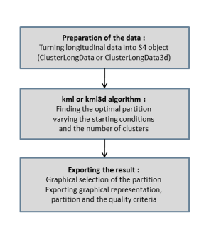


```

#### Data preparation

kml3D algorithm manages to memorize the cluster partitions it creates. To do this, the dataset needs to be converted into a S4 object, which is in the format of a 3D matrix. Since this is an significant aspect in this algorithm, it needs to be viewed in depth. As mentioned before, the original dataset is in longitudinal format, which means that for every given subject (ID), there is multiple values taken at different time intervals, for the four pulses. The dataset was first split into four seperate datasets, each for one pulse. For each dataset, imputation was performed, to plug in the missing values.

**Imputation** for kml3d consists of various techniques. The function "imputation" from the package Kml3d helps to achieve this. As explained in Genolini (2015), there are various methods to impute the data, and it depends if the imputation needs to be done by cross-sectional methods (imputation depending upon the measurements of other individuals at same time), or longitudinal methods (using only the measurements of the variable of a particular individual; does not depend upon other individuals). For the dataset which is used here, since the pulses are independant of other individuals but belongs to a single individual person, longitudinal imputation method is considered. Under this, various ways are possible; here "trajHotDeck" is used. "trajHotDeck" works in the following way: the missing values are imputed by any randomly choosen value from the non-missing values, i.e, for a particular individual, the values which are imputed, are selected randomly from the existing values of pulse of that person itself. Then all the four subdatasets (one for each pulse) are combined together and are used to form the 3D matrix (also known as the S4 object). The command "clusterLongData3d" is useful for this. The subjects, variables and the different time points at which the measurements were taken need to be specified. 

The three dimensions (in the current dataset) are the individuals, age (denoted by time), and varnames (which refer to the four pulse rates). The Quality criterion selects the best number of clusters (and is explained in detail in the next section), where the partitions are compact and well separated from other clusters. For simplicity, the dataset was divided and analysed seperately for males and females. Figure \ref{img:img10} shows the details of the 3D matrix once the dataset has been converted (for males). Here, **idAll** represents the identifier for every individual (shown as 5408, which is the number of normal BMI boys in the experiment). **varnames** represents the measured variables, which are the four pulses (Pulse0, Pulse1, Pulse5 and Pulse10). **time** is the different points in time at which each individual has the measurements taken, which is the age of the children in this dataset. 

```{r, fig.height=7, fig.cap="Dataset in 3D Matrix Form \\label{img:img10}",fig.pos="h"}

knitr::include_graphics("cld.png")

```

#### Clustering process

The kml() function can be called once the ClusterLongdata object (S4 3D matrix) has been created. It runs K-means many times, varying the starting conditions, as per mentioned. By default, it checks the best number of clusters, and runs k-means for every combination of k between 2 and 6 for 20 times. @gen2015 mentions the various arguments the kml() command uses. **nbClusters ** and **nbRedrawing** denote the number of clusters kml need to check (varies between 2 to 6), and the number of times the cluster needs to run. 

#### Visualization of the clusters

kml() algorithm can store the partition found in the "clusterLongData" object. The partitions are saved at reguar intervals, so that any interruption will not result in lost data. Hence, to visualise the clustering results, seperate command is not needed. There is an in-built command in kml, namely **choice()**, which provides the best cluster based on the Quality Criterion selected (explained in detail in the next section) and the trajectory plot for the best number of clusters with each of the different clusters represented by a different colour.

### Quality criterion

As explained in K-mean clustering section, the clustering is performed many times. How is it possible to know which gives the best result? That is the main functionality of the Quality Criteria. Quality criteria are indices that take high values for partitions of high quality and low values for partitions of low quality. There are many Quality Criterions which can be possible depending upon the high and low indices, but generally speaking: a good partition is a partition where clusters are compact and well separated from each other. So the cluster indices calculate within cluster compactness index and between-cluster spacing index, and then divide them both by one another.

* The Calinski & Harabasz criterion, which is the default method used in kml3D, is given by

$$
C(k) = \frac{Trace(B)}{Trace(W)}.\frac{(n-k)}{(k-1)}
$$
where B is the between-cluster covariance matrix and W is the within-cluster covariance matrix. It is to be noted that high values of Trace(B) denotes well separated clusters and low values of trace(W) denotes compact clusters. 

* Apart from this, there exists few others, such as: Calinski & Harabasz, Kryszczuk variant, Calinski & Harabasz, Genolini variant, Ray & Turi criterion and Davies & Bouldin criterion. All the Quality criteria which are mentioned in kml3d  should be maximised. 

\begin{landscape}

```{r echo=FALSE, fig.align='center', fig.cap="Calinksi-Harabatz Quality Criterion\\label{img:img11}", fig.height=7, fig.pos="h", fig.width=7}

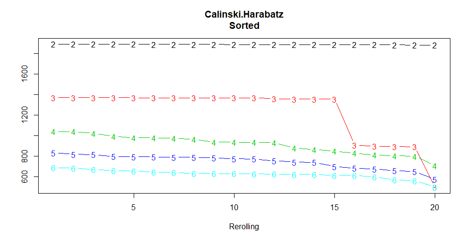


```

\end{landscape}

**The results of Calinski-Harabatz for boys are displayed in Figure \ref{img:img11}.**  The Y-axis of the graph denotes the Quality criterion, and the X-axis (given by rerolling), denotes the number of times the clustering process took place. Higher the values, better is the Quality. It is clear that the best number of clusters is 2, as it has the highest quality criterion. For girls, even though the Quality criterion value might vary, the graph (which is not shown here) and results were similar, i.e, the best number of clusters was two, and the partition was made accordingly.

### Results for boys

Figure \ref{img:img12} and \ref{img:img13} denotes the clustering results for sample of boys for Pulse0, Pulse1, Pulse5 and Pulse10. The Y-axis denotes the values of the range of the pulse rates. The graph denotes how trajectory of pulse rates varies with age. The kids with high pulse trajectory, belongs to the cluster A (red), and those with lower pulse rates belongs to cluster B (blue). Generally, kids have resting pulse rates (denoted by Pulse0) that vary between 70-110, and hence anything beyond that is considered elevated. Likewise, on looking closer at all the four pulses, it is highly possible that the kids of cluster A, are more susceptible to be affected by Hypertension, than the kids of cluster B. Major focus is to be given to Pulse5 and pulse 10, which shows significant difference among the clusters. Hence, those kids, belonging to the higher pulse cluster might need to be considered for further tests, to have a better understanding of their health. The trajectory values for both the clusters might have occasional, abnormal high or low values, which might not be same as the cluster behaviour. This denotes that the kid might have had a change in their health for that particular age alone. Otherwise, generally speaking, the kid allocated to a particular cluster follows the health behaviour of that cluster.

\begin{landscape}
```{r echo=FALSE, fig.align='center', fig.cap="Clustering results for boys\\label{img:img12}", fig.height=9, fig.pos="h", fig.width=7}
#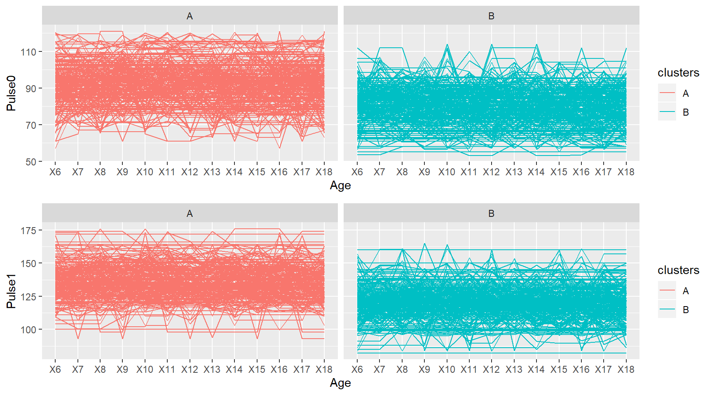

knitr::include_graphics("res_boys11.png")
```


```{r echo=FALSE, fig.align='center', fig.cap="Clustering results for boys\\label{img:img13}", fig.height=9, fig.pos="h", fig.width=7}
#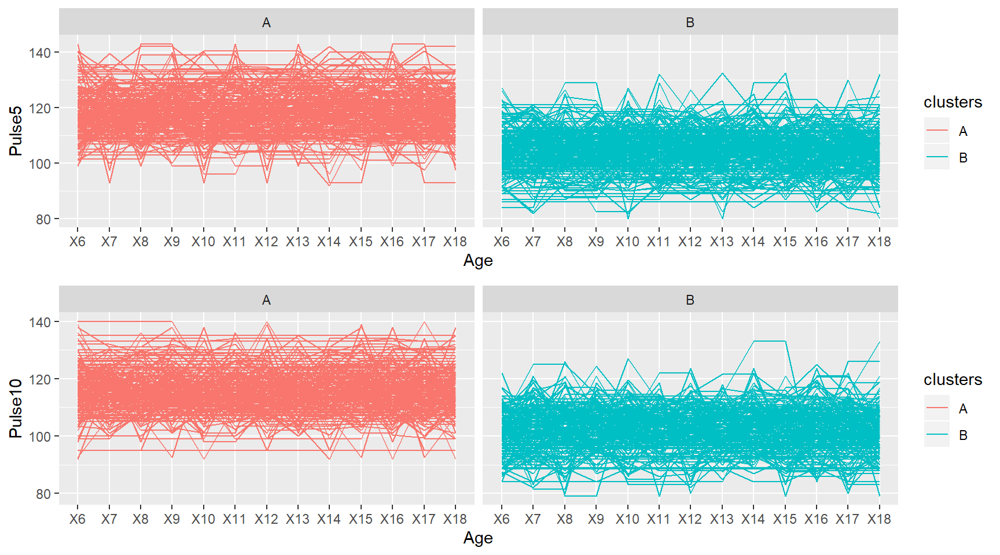
knitr::include_graphics("res_boys21.png")
```
\end{landscape}


\newpage

Figure \ref{img:img14} shows the allocation of kids (denoted by ID in the Y-axis) with respect to the clusters. The X-axis of the graph, marked as pulse1 (or pulse10), is the average pulse1 (or pulse10) value of every individual, over all the ages taken into account. From both the graphs, it can be seen that the subjects are divided into their respective clusters, based on the pulse rates. For pulse1, the values extend between 70 to 170 (approximately) and for pulse10 it ranges to 80 to 140. Though it can be seen that the clusters are not separated precisely (due to presence of outliers), the clustering is done reasonably well.

This graph is intended to show the difference between average pulse1 and average pulse10 for every individual. In other words, how much does the pulse1 reduce (on average) for every individual in 10 minutes? Does it reach the normal pulse range (70-110)? Considering the graph, it can be noted that, if a kid's pulse rate does not fall much, it means he takes more than 10 minutes to recover from the running. **It is observed that, for some of the subjects, the pulse rates reduce to end up within the basic resting pulse rate limit (70-110) in 10 minutes, but there are few kids whose heart rate do not reduce at a rapid pace, which means, they might be less healthy when compared to the others.** On a closer look at the graph, it can be seen that roughly, the children in the cluster A (marked by red) do not have their pulse rates move into the normal resting pulse rate zone (70-110) within 10 minutes, but the children belonging to the cluster B have theirs in the normal zone in 10 minutes. Thus, it can be denoted that the children in cluster B are healthier when compared to the children in cluster A, and the kids belonging to cluster A might need to undergo further tests to check their health, as they seem to have elevated pulse rates (which in turn means higher chances of being affected by cardiac related problems), in comparison to those of cluster B.

\newpage

```{r echo=FALSE, fig.align='left', fig.cap="Boys clustered based on Average Pulse\\label{img:img14}", fig.height=3, fig.pos="h", fig.width=7}

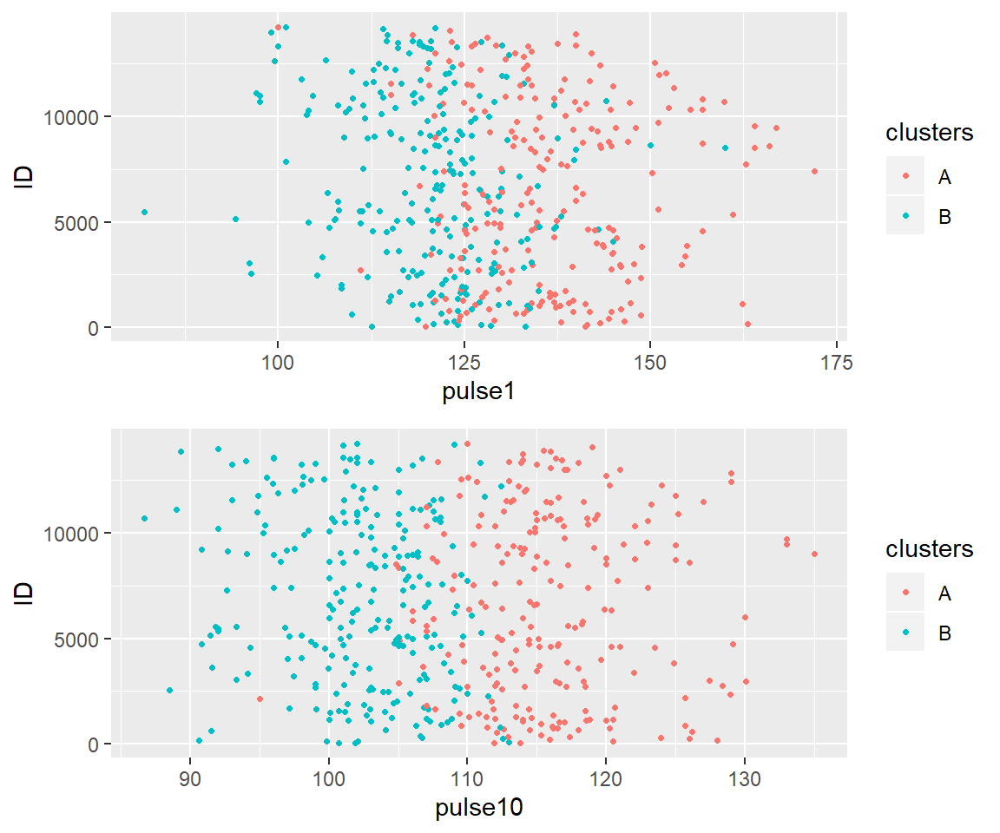

```

Figure \ref{img:img141} is a graph which attempts to show the values of Pulse0 on the Y-axis and Pulse10 on the X-axis. In the graph, the black dashed line is the boundary for the pulse rates. The pulse rate value of 110 is the boundary which is denoted, because 70-110 is the normal pulse rate. It is to be noted that the the kids who are places outside the boundaries, are the ones who have their normal pulse rates beyond 110 (which is considered to be elevated), and also the ones whose pulse rate do not return to the normal category within 10 minutes. Coincidentally, it is to be noted that most of them fall under cluster A, which is the same as the cluster with elevated pulse rates as mentioned in the previous graphs. Thus, to reinforce what was previously established, the children of the elevated cluster might be having cardiac 


\begin{landscape}
```{r echo=FALSE, fig.align='left', fig.cap="Boys clustered based on Average Pulse\\label{img:img141}", fig.height=3, fig.pos="h", fig.width=7}
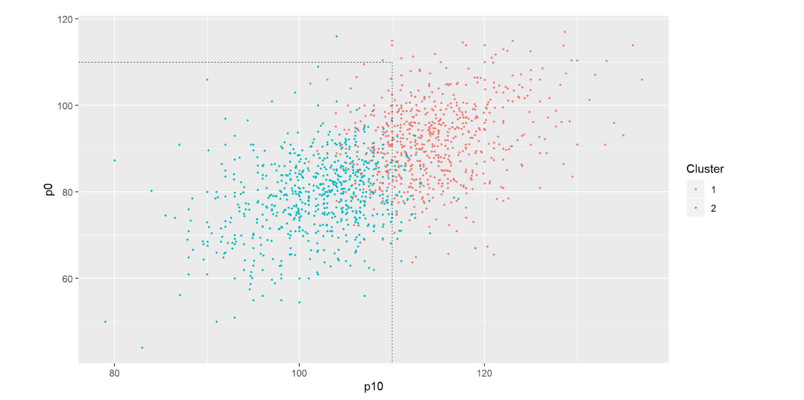
#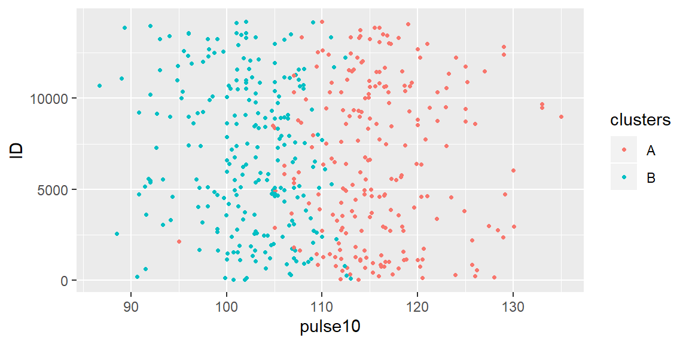
```
\end{landscape}

related issues, or might be concluded to be less healthy in general, when compared to the kids in the other cluster. 

### Results for Girls

Figure \ref{img:img15} and \ref{img:img16} shows the clustering results for girls. One major difference between boys and girls is that, the range of pulse rates seem to be higher for girls than for boys. The results seem to be similar to those of boys, i.e, the observations are segregated into two clusters, with one containing girls with elevated pulse rates, and the other containing the girls with normal pulse rates. The girls belonging to the cluster with higher pulse rates need to be verified if they have any health issues.


\newpage
\begin{landscape}

```{r echo=FALSE, fig.align='center', fig.cap="Clustering results for girls\\label{img:img15}", fig.height=9, fig.pos="h", fig.width=7}
#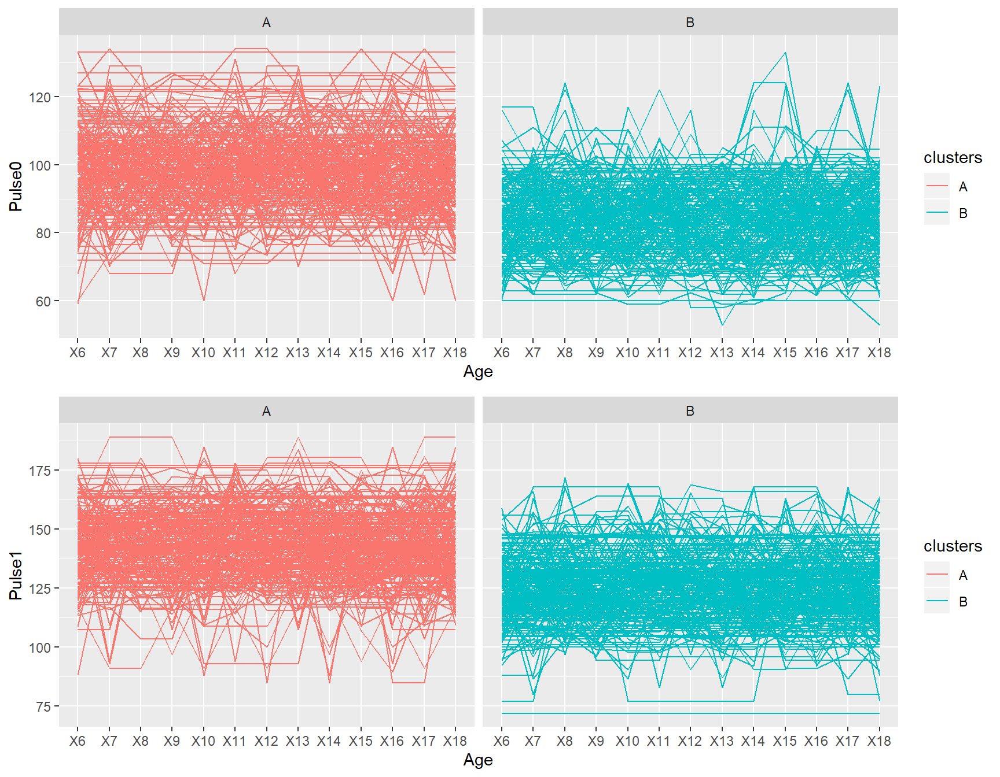
knitr::include_graphics("res_girls11.png")
```


```{r echo=FALSE, fig.align='center', fig.cap="Clustering results for girls\\label{img:img16}", fig.height=9, fig.pos="h", fig.width=7}
#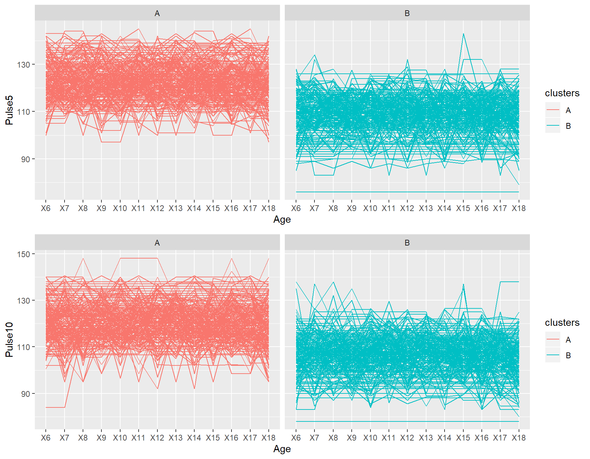
knitr::include_graphics("res_girls21.png")

```

\end{landscape}

\newpage
Figure \ref{img:img17} shows similar results to that of boys. The range for (Average) pulse1 seems to be 100 to 160, and after 10 minutes the pulse seems to be in the range of 90 to 140. Hence, the conclusion is also similar: Many girls were found to have their pulse rates reduced (to the normal rate of 70-110) in 10 minutes after the exercise was done (who belong to cluster B) and there were few whose rate did not lessen as much (Belonging to cluster A), who have higher chances of being affected by cardiac complications.


```{r echo=FALSE, fig.align='left', fig.cap="Girls clustered based on Average Pulse\\label{img:img17}", fig.height=3, fig.pos="h", fig.width=7}
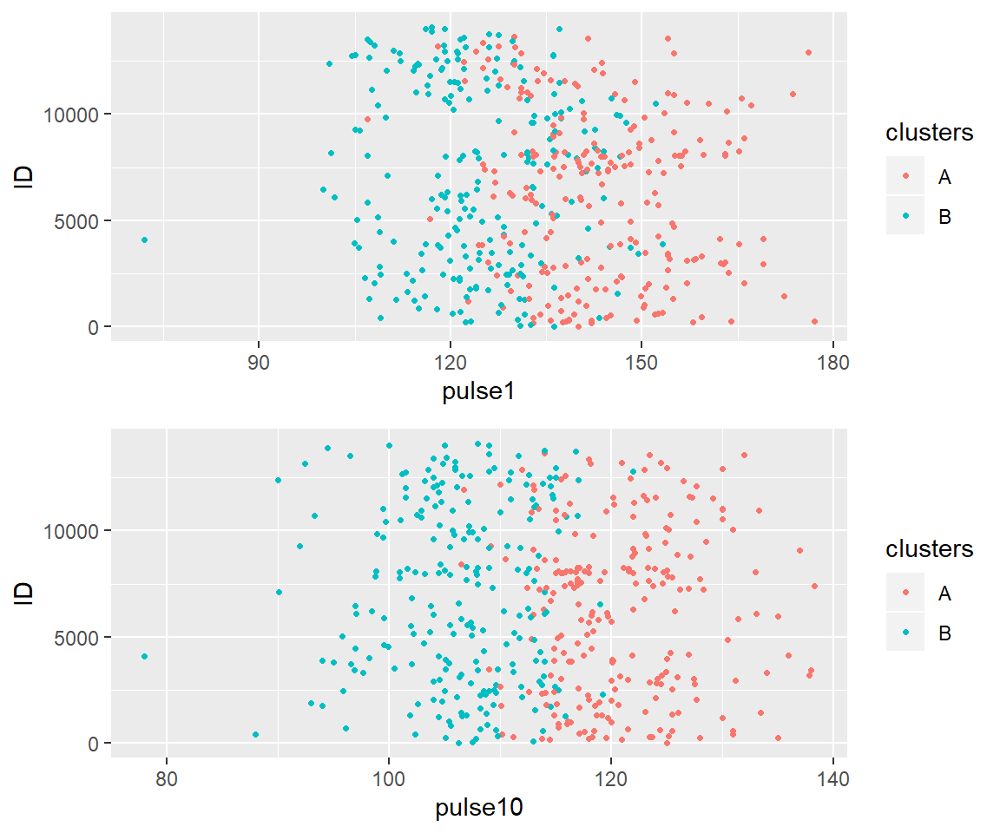
```

From figure \ref{img:img171}, similar conclusion to those of boys could be drawn: cluster A is the cluster with elevated pulse rates, and girls from this cluster may need further diagnosis, as there is higher chance of them suffering from health problems when compared to girls of cluster B.


\begin{landscape}
```{r echo=FALSE, fig.align='left', fig.cap="Girls clustered based on Average Pulse\\label{img:img171}", fig.height=3, fig.pos="h", fig.width=7}
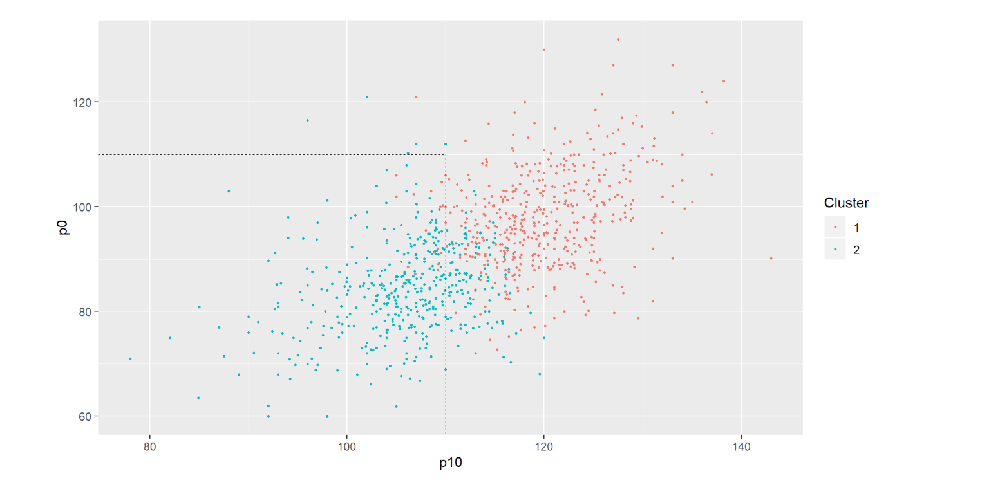

```
\end{landscape}


\newpage

# Summary and Conclusion

Human health is an important aspect of our lives in the present era, which many people ignore often, or do not take heed of. The main reason is that it cannot be measured or tested easily, as various health problems have different symptoms. Every other medical problem needs just a test or two, but cardiac related problems has a lot of factors that needs to be taken into consideration, such as work pressure, family scenarios, diet taken, active lifestyle, fitness levels, etc. Also, the symptoms are not always directly visible. This thesis attempts to provide an analytical approach so as to find out how to deal with this issue, using the heart rates taken at various points in a child's life. The most important thing is to not only consider the resting heart rate alone, but other forms of heart rates as well. Once subjects with elevated heart rates are segregated, further analysis and specific tests can be done to those subjects alone, and not to entire population, so as to save cost and time. Also, if this can be achieved successfully for kids, early treatment is fairly possible, enabling a healthy life when they reach their adulthood. 

There can be certain further enhancements that can be applied to this thesis. Blood pressure can be considered as another factor, that can be taken in collaboration with the pulse rates, so as to obtain better results. Along with BP and Pulse rates, a model can be fit using the other variables, so as to try to predict how cardiac related problems affects children with similar conditions. Also, there might be other packages, which can handle clustering of Longitudinal data in a better way. They can be used to find out further results. 


\newpage

# References
<div id="refs"></div>

\renewcommand{\thesection}{\Alph{section}}
\setcounter{section}{1}

\newpage

# Appendix
## Supporting material and code{#app:mat}

* **Code for Clustering:** https://github.com/Deepak021093/ST606_Project/blob/master/Final_Report/Clustering_final.Rmd

* **Code for Exploratory analysis:** 
https://github.com/Deepak021093/ST606_Project/blob/master/Final_Report/Exploratory%20analysis_final.Rmd

* **Other required files:** https://github.com/Deepak021093/ST606_Project/tree/master/Final_Report


